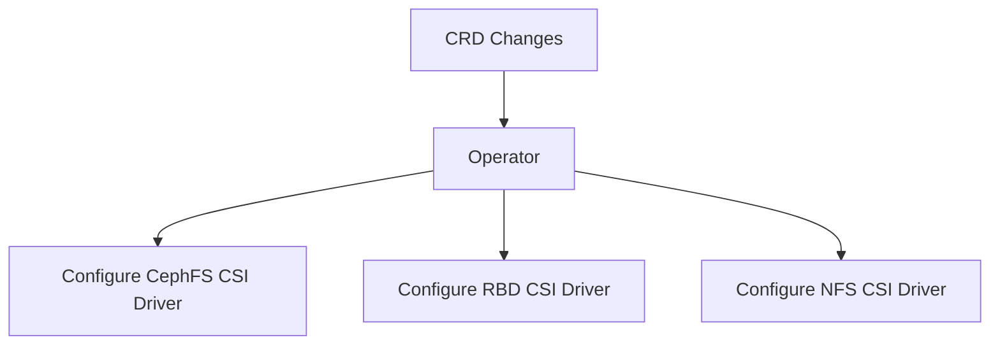

# Ceph CSI Operator Design Document

## Introduction

This document outlines the design of the Ceph-CSI Operator, which aims to
provide Kubernetes native management interfaces for Ceph-CSI drivers (CephFS,
RBD, and NFS) for Kubernetes based environments. The operator automates the
deployment, configuration, and management of these drivers using new Kubernetes
APIs defined as a set of Custom Resource Definitions (CRDs).

## System Overview

The Ceph-CSI Operator is a Kubernetes operator that offers a Kubernetes native
management interfaces for Ceph CSI drivers. It provides a set of new Kubernetes
APIs (CRDs) for governing deployment and management of Ceph-CSI drivers, as
well as connection details to Ceph clusters. The operator ensures that the
desired state specified in the CRDs is maintained in the cluster.

## Assumptions and Dependencies

Kubernetes cluster is available and operational. Ceph cluster is set up and
accessible from the Kubernetes cluster. Users are familiar with Kubernetes and
Ceph concepts. CRD and operator versions are compatible with the Kubernetes
version in use.

## Goals and Guidelines

- Automate the deployment and lifecycle for Ceph-CSI drivers.
- Provide a consistent and flexible configuration mechanism using CRDs.
- Enable namespace-scoped configurations for different Ceph-CSI drivers.
- Ensure high availability and scalability of the operator.
- Support multiple deployment modes for the operator:
  - Own-namespace: the operator manages a single Ceph-CSI driver in the current
    namespace where operator is deployed.
  - Multi-namespace: the operator manages Ceph-CSI drivers in user-specified
    namespaces.
  - All-namespaces: the operator manages Ceph-CSI drivers in all namespaces.

## Development Methods

Use kubebuilder framework which is highly used in operator development,
following Kubernetes best practices for controllers and operators

## Architecture



In this diagram:

- **CRD Changes**: Represents changes made to Custom Resource Definitions,
  which trigger actions in the operator.
- **Operator**: Listens for changes in CRDs and initiates the installation and
  configuration of CSI drivers.
- **Configure CephFS, NFS, RBD**: Actions performed by the operator to install
  and configure the respective CSI drivers based on the CRD changes.

## CRDs for ceph-csi-operator

### OperatorConfig CRD

Manages operator-level configurations and offers a place to overwrite settings
for CSI drivers. This CRD is a namespace-scoped CRD and a single CR named
ceph-csi-operator-config can be created by an admin inside the operator's
namespace.

The configurations are categorized into 2 different types

- Operator configurations
- Default configuration overwrites applied to all Ceph CSI drivers

```yaml
---
kind: OperatorConfig
apiVersion: csi.ceph.io/v1alpha1
metadata:
  name: ceph-csi-operator-config
  namespace: <operator-namespace>
spec:
  log:
    verbosity: 1
  driverSpecDefaults:
    log:
      verbosity: 5
      rotation:
        # one of: hourly, daily, weekly, monthly
        periodicity: daily
        maxLogSize: 500M 
        maxFiles: 5
        logHostPath: /var/lib/cephcsi 
    clusterName: 5c63ad7e-74fe-4724-a511-4ccdc560da56
    enableMetadata: true
    grpcTimeout: 100
    snapshotPolicy: auto-detect
    generateOMapInfo: true
    fsGroupPolicy: File
    encryption:
      configMapRef:
        name: encryption-config-map-name
    nodePlugin:
      priorityClassName: system-node-critical
      updateStrategy:
        type: RollingUpdate
        rollingUpdate:
          maxUnavailable: 1
      labels:
        app: csi
      annotations:
        k8s.v1.cni.cncf.io/networks: macvlan-conf-1
      affinity:
        nodeAffinity:
          requiredDuringSchedulingIgnoredDuringExecution:
            nodeSelectorTerms:
            - matchExpressions:
              - key: storage
                operator: In
                values:
                - node
      tolerations:
      - key: storage
        operator: Exists
      resources:
        registrar:
          limits:
            cpu: '200'
            memory: '500'
          requests:
            cpu: '100'
            memory: '250'
        liveness:
          limits:
            cpu: '200'
            memory: '500'
          requests:
            cpu: '100'
            memory: '250'
        plugin:
          limits:
            cpu: '200'
            memory: '500'
          requests:
            cpu: '100'
            memory: '250'
      volumes:
      - name: host-run
        volumes:
          hostPath:
            path: "/run"
            type: Directory
        volumeMounts:
          name: ''
          readOnly: true
          mountPath: "/run"
          mountPropagation: Bidirectional
      kubeletDirPath: "/var/lib/kubelet"
      imagePullPolicy: IfNotPresent
    controllerPlugin:
      priorityClassName: system-cluster-critical
      labels:
        app: cephfs-ctrlplugin
      privileged: true  
      annotations:
        k8s.v1.cni.cncf.io/networks: macvlan-conf-1
      replicas: 2
      affinity:
        nodeAffinity:
          requiredDuringSchedulingIgnoredDuringExecution:
            nodeSelectorTerms:
            - matchExpressions:
              - key: storage
                operator: In
                values:
                - node
      tolerations:
      - key: storage
        operator: Exists
      resources:
        attacher:
          limits:
            cpu: '200'
            memory: '500'
          requests:
            cpu: '100'
            memory: '250'
        snapshotter:
          limits:
            cpu: '200'
            memory: '500'
          requests:
            cpu: '100'
            memory: '250'
        resizer:
          limits:
            cpu: '200'
            memory: '500'
          requests:
            cpu: '100'
            memory: '250'
        provisioner:
          limits:
            cpu: '200'
            memory: '500'
          requests:
            cpu: '100'
            memory: '250'
        omapGenerator:
          limits:
            cpu: '200'
            memory: '500'
          requests:
            cpu: '100'
            memory: '250'
        liveness:
          limits:
            cpu: '200'
            memory: '500'
          requests:
            cpu: '100'
            memory: '250'
        plugin:
          limits:
            cpu: '200'
            memory: '500'
          requests:
            cpu: '100'
            memory: '250'
    liveness:
      metricsPort: 8000
    leaderElection:
      leaseDuration: 100
      renewDeadline: 100
      retryPeriod: 10
    deployCSIAddons: true
    cephFsKernelClient: true
    cephFsKernelMountOptions: ms_mode=secure
status:
  phase: Succeeded
  reason: operator config successfully created
```

### Driver CRD

Manages the installation, lifecycle management, and configuration for CephFS,
RBD, and NFS CSI drivers within namespaces.

- Allows customization of driver settings on a per-driver basis.
- Best practice dictates only a single instance of RBD/NFS/CephFS drivers
  should be created in a single namespace. If there is a need to deploy a
  second instance of a driver of a similar type, it should be deployed in a
  different namespace.
- Each CSI driver must have a unique name across all namespaces.

```yaml
---
kind: Driver
apiVersion: csi.ceph.io/v1alpha1
metadata:
  name: "<prefix>.<driver_type>.csi.ceph.com"
  namespace: <operator-namespace>
spec:
  fsGroupPolicy: File
  encryption:
    configMapRef:
      name: encryption-config-map-name
  nodePlugin:
    priorityClassName: system-node-critical
    updateStrategy:
      type: RollingUpdate
      rollingUpdate:
        maxUnavailable: 1
    labels:
      app: cephfs-nodeplugin
    annotations:
      k8s.v1.cni.cncf.io/networks: macvlan-conf-1
    logRotator:
      cpu: "100m"
      memory: "32Mi"       
  controllerPlugin:
    labels:
      app: cephfs-ctrlplugin
    annotations:
      k8s.v1.cni.cncf.io/networks: macvlan-conf-1
    replicas: 2
    leaderElection:
      leaseDuration: 100
      renewDeadline: 100
      retryPeriod: 10
    attachRequired: true
    logRotator:
      cpu: "100m"
      memory: "32Mi"     
  liveness:
    metricsPort: 8000
  deployCSIAddons: false
  kernelClient: true
  kernelMountOptions: ms_mode=secure
status: {}
```

### CephConnection CRD

Stores connection and configuration details for a single Ceph cluster and
provide the information to be used by multiple CSI drivers.

```yaml
---
kind: CephConnection
apiVersion: csi.ceph.io/v1alpha1
metadata:
  name: ceph-cluster-1
  namespace: <operator-namespace>
spec:
  monitors:
  - 10.98.44.171:6789
  - 10.98.44.172:6789
  - 10.98.44.173:6789
  ReadAffinity:
    crushLocationLabels:
    - kubernetes.io/hostname
    - topology.kubernetes.io/region
    - topology.kubernetes.io/zone
  rbdMirrorDaemonCount: 2
status: {}
```

### ClientProfile CRD

Contains details about CephFS, RBD, and NFS configuration to be used when
communicating with Ceph. Include a reference to a CephConnection holding
the connection information for the target Ceph cluster.

```yaml
---
kind: ClientProfile
apiVersion: csi.ceph.io/v1alpha1
metadata:
  name: storage
  namespace: <operator-namespace>
spec:
  cephConnectionRef:
    name: ceph-cluster-1
  cephFS:
    subvolumeGroup: csi
    kernelMountOptions: readdir_max_bytes=1048576,norbytes
    fuseMountOptions: debug
  rbd:
    radosNamespace: rados-test
status: {}
```

### ClientProfileMapping

The ClientProfileMapping CR contains a mapping between pairs of Ceph
CSI client profiles. The information in this CR helps Ceph CSI identify
peered configuration between different k8s cluster. This information is 
utilized in the management and consumption of volumes in backup and 
DR scenarios

```yaml
---
kind: ClientProfileMapping
apiVersion: csi.ceph.io/v1
metadata:
  name: storage
  namespace: <operator-namespace>
spec:
  mappings:
  - localClientProfile: local-clientprofile-1
    remoteClientProfile: remote-clientprofile-1
    blockPoolIdMapping: 
    - [1, 2]
    - [2, 2]
  - localClientProfile: local-clientprofile-2
    remoteClientProfile: remote-clientprofile-2
    blockPoolIdMapping:
    - [2, 1]
```

By following this design document, the Ceph CSI Operator can be effectively
implemented, providing automated and scalable management of Ceph CSI drivers
within Kubernetes clusters.

